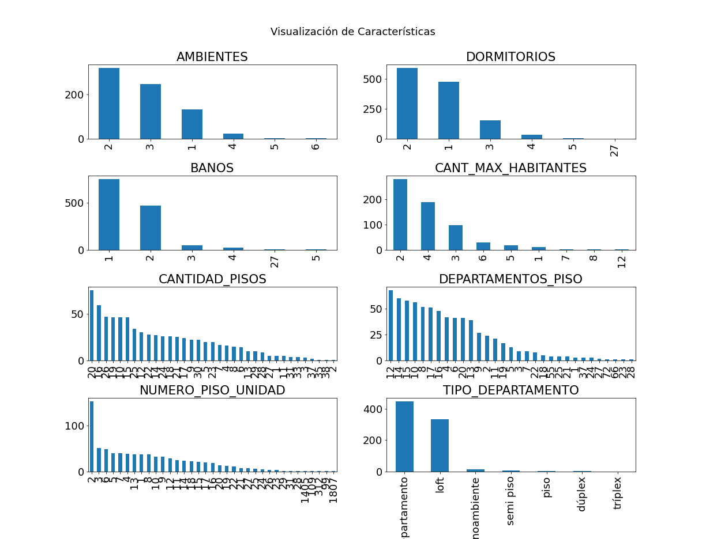
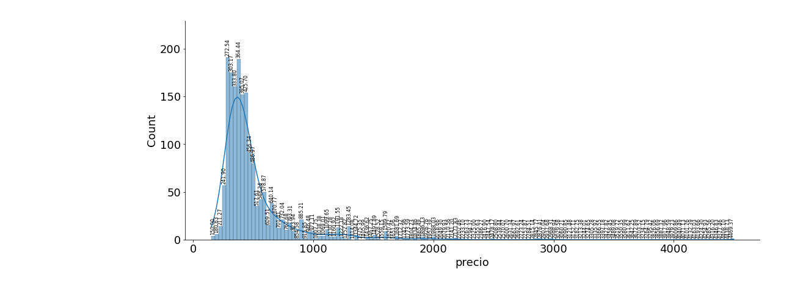
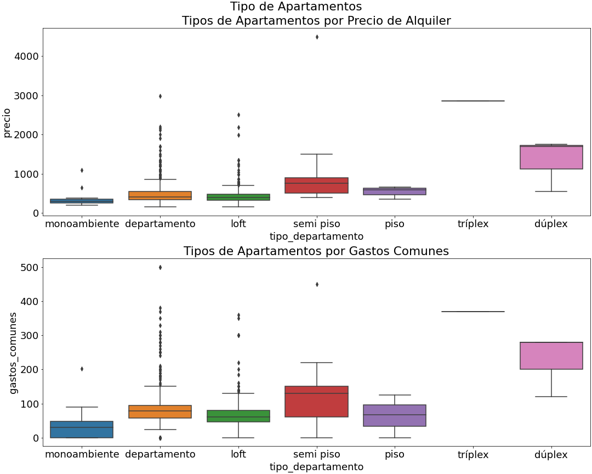
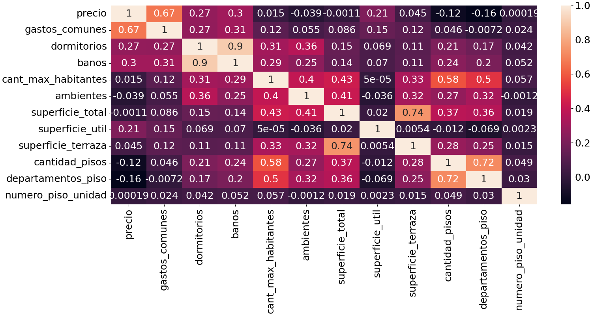

#  Analisis exploratorio de Departamentos en Arriendo en Santiago de Chile


El objetivo de este proyecto es encontrar la mejor opción de alquiler de departamentos en Santiago de Chile. Para ello, se realizó un proceso de Web Scraping en el sitio web portalinmobiliario, para obtener información sobre las ofertas de arriendo de departamentos en Santiago de Chile. Con la información obtenida, se creó una base de datos y se llevó a cabo un análisis exploratorio de datos para obtener patrones que ayuden a tomar mejores decisiones en la búsqueda del departamento ideal.

En el análisis exploratorio de datos, se encontró la distribución de las características de los departamentos en arriendo, como la cantidad de baños, habitaciones, entre otras. También se analizó la distribución de los precios de alquiler de los departamentos en arriendo y su relación con el tipo de departamento. Además, se hizo un análisis de las correlaciones entre las variables, como el precio de alquiler, el área en metros cuadrados, los gastos comunes, entre otras.

En resumen, este proyecto busca ayudar a encontrar la mejor opción de alquiler de departamentos en Santiago de Chile a través de un análisis exploratorio de datos.

El notebook y dataset se pueden ver en kaggel haciendo click [Aquí](https://www.kaggle.com/code/edwight/alquiler-de-departamentos-en-santiago-de-chile).

### 1. Obteniendo el Data de Arriendos:
 El proceso de Web Scraping consiste en obtener información de una pagina web **portalinmobiliario** de manera automatizada, esta información se guarda en una base de dato llamada **"departamento.db"**,  la informacion se pasa por un proceso de limpieza de la data que se guarda en la carpeta **clean_data** como un archivo **clean_alquiler_dd_mm_yy **.
 
### 2 Acerca del dataset 
El dataset contiene las siguientes columnas:

- Precio de Alquiler.
- Direccion del Departamento 
- Area en Metros Cuadrados del Departamento.
- Cantidad de Habitaciones.
- Cantidad de Baños.
- Dirección del Departamento.
- Gastos Comunes.
- Fecha de Publicacion.
- El Tipo de Departamento.
- La Región y La Comuna.
- El Enlace 
- Coordenadas Geográficas 

Requisitos previos
Antes de ejecutar este script, asegúrese de tener instalados los paquetes necesarios:


## instalación 
- Crear un ambiente virtual
 ```sh
python3 -m venv venv
 ```
- Activar el ambiente en **bash**
```sh
source venv/bin/activate  
```
- activar el ambiente con **fish**
```sh
source venv/bin/activate.fish 
```
- instalar los paquetes y librerías necesarias 
```sh
pip install requirements.txt 
```

### Uso
Para ejecutar este script, simplemente proporcione la URL del sitio web que desea extraer información. Por ejemplo:

```sh
python main.py
```
Esto mostrará un  menú con las siguientes opciones 

```sh
 """
    ---------------------------------------------------
                        MENU
    ---------------------------------------------------
    1 - hacer scrapping a portalinmobiliario
    2 - hacer scrapping a cada pagina de portalinmobiliario
    3 - transformar datos 
    q - salir

"""
```

## Analisis exploratorio de alquiler de Datos 

### - ¿Cuál es la distribución de las características de los departamentos en Arriendo?, como número de baños, número de habitaciones, etc.
La cantidad de publicaciones tiene:
- 2 ambientes
- 2 dormitorios
- 1 baño
- 2 habitantes máximos
- la mayoría de los departamentos tiene 20 pisos. Seguidos de 16 pisos
- el piso más frecuente en la publicación es el piso 12 seguido del 14
- la mayoría de los departamentos son tipo departamento seguido de Lot 



### - ¿Cuál es la distribución de los precios de alquiler de los departamentos en Arriendo?
La distribución de los precios de alquiler se concentra de 275 a 524 mil pesos chilenos. En mi caso estoy dentro del área de mayor densidad con pagando 470 mil pesos



### - ¿Cuál es la distribución de los precios de los departamentos en Arriendo por tipo de departamento?



Los tipos triplex y penthouse son los menos frecuentes, mientras el tipo departamento tienen una mayor cantidad de valores atípicos. Los que tienen una mayor cantidad de variabilidad son duplex, piso y semi piso. Lo cual significa que su rango de precio y gastos comunes es más amplia. 
Finalmente departamento y loft tiene una menor variabilidad su rango de precio es menor


### - Correlaciones entre las variables 

Se observa una baja correlación del precio de alquiler con las demás variables. Siendo los gastos comunes con apenas un 67 % de relación con el precio. Aun así la variable baños está fuertemente relacionada con la cantidad de dormitorios, seguido de superficie total y la superficie de la terraza. Esto lo que quiere decir es que están relacionadas así por ejemplo si un departamento tiene más baños entonces también tiene más habitaciones.




